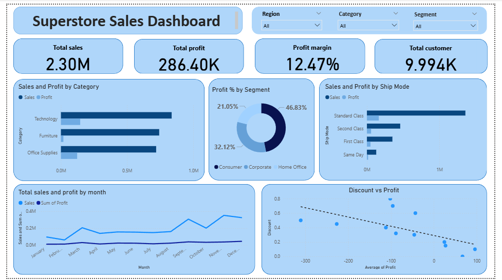

# 🛒 Superstore Sales Analysis | SQL + Python + Power BI

## 📖 Project Overview
This project analyzes an **E-commerce Superstore dataset** to uncover insights into **sales, profit, ship mode and customer behavior**.  
The analysis was performed using **SQL for data extraction and solving real-world business problems**, **Python for cleaning and exploratory analysis**, and **Power BI for interactive dashboards**.  
The final deliverable is a dashboard that supports **data-driven decision-making** for sales and marketing teams.

---

## 📂 Dataset
The dataset used in this project is publicly available:  
👉 [Superstore Dataset on Kaggle](https://www.kaggle.com/datasets/vivek468/superstore-dataset-final)  

- **Rows**: 9,994  
- **Columns**: 21 (Sales, Profit,Discount,Ship mode, Customer, Segment, Region, Category, etc.)  
- **Time Period**: 2014–2017  

---

## 🎯 Business Objectives
- Identify the most profitable product categories and sub-categories  
- Track sales and profit trends over time (monthly/quarterly/yearly)  
- Compare regional performance and customer segments
- Identify how discount is impacting overall profit margin  
- Identify top customer contributing profitability (~Pareto Principle) 
- Provide actionable recommendations to improve profitability  

---

## 🛠️ Tools & Technologies
- **SQL** → Data extraction, data cleaning, joins, aggregations,window function  
- **Python** → Pandas, Matplotlib, Seaborn (data cleaning & EDA)  
- **Power BI** → Interactive dashboard and KPIs  

---

## 📂 Project Workflow
1. **Data Extraction & Problem-Solving (SQL in Python)**  
   - Connected PostgreSQL database with Python (using psycopg2/SQLAlchemy).  
   - Wrote SQL queries not just to fetch data but also to **solve real-world business problems** such as:  
     - Sales & profit trends over time  
     - Identifying top-performing product categories  
     - Analyze uneven regional performance  
     - Customer segmentation analysis 
     - Identify impact of discount on sales and profitability 
     - Applying Pareto principle to find 20% customers driving 87% of profit

    - Some example:  
    **1. Which product categories and sub-categories are the highest revenue generators?**
     ```select p.category,p.sub_category, 
      round(sum(o.sales)) total_revenue,
      sum( round(sum(o.sales)) ) over(order by  round(sum(o.sales)) desc)*100
      /sum(round(sum(o.sales))) over() as cum_prc
      from orders o 
      join products p on o.product_id=p.product_id
      group by 1 ,2
      order by 3 desc;
     ```
     **2. Is revenue concentrated in a small group of customers (Pareto 80/20 rule)?**
     ```
     with top_cust as 
     (select c.customer_name, round(sum(o.sales)::numeric,2) as revenue
     from orders o join customers c 
     on c.customer_id=o.customer_id
     group by 1
     order by 2 desc ),

     ranked as 
     (select customer_name,revenue,
     sum(revenue) over( order by revenue desc) as cum,
     sum(revenue) over() as sum_cum
     from top_cust
     )
     
     select customer_name,revenue,
     round(cum*100/sum_cum,2) as prc_cumulative
     from ranked order by 2 desc

     ```

2. **Exploratory Data Analysis (Python)**  
   - Used Pandas for further manipulation and consistency checks  
   - Created visualizations (Seaborn/Matplotlib) for trends, correlations heatmap and regional and categorical sales  

3. **Dashboard Development (Power BI)**  
 
   - Designed an interactive **executive dashboard** in Power BI to support strategic decision-making.  
   - Incorporated **Key Performance Indicators (KPIs):** Total Sales, Total Profit, and Profit Margin %.  
   - Integrated **dynamic slicers** (Region, Category, Segment) to allow flexible drill-down analysis.  
   - Developed a variety of **visualizations** tailored to business needs:  
     - Bar charts   → Product category and sub-category performance  
     - Line charts  → Sales and profit trends over time (monthly/quarterly)  
     - Scatter plot → Effect of discount in Profit margin 
 

   ---


## 📊 Dashboard Preview



---

## 💡 Key Insights
- **Technology** category generated the highest profit margin 
- **4 Sub-category**(chair,phones,storage,binders) are responsible for 54% revenue 
- In **nov and dec** sales are higher but no impact on profit % due to heavy discounts
- almost 34% profit is coming from **west region** which is 2x(double) from **south** 
- **Pareto Principle**: ~20% of top customers contributed nearly 87% of total profit
- **standard class** is most popular mode of shipping among customers.  
- ship mode-**same day,first class** which has less delivery time ,producing higher profit margin
  

---

## 🚀 Business Recommendations
- Increase marketing investment in Technology products 
- keep discount around 20% to reduce losses in each category
- review discount policies and operational and logistic efficiency in south 
- review operational and logistic efficiency in **home office** category as it is the most under performing category acrros all region
- Implement a loyalty program or exclusive offers for high-value customers who generate most revenue.
- keep discouunt % in south within 15% to increse profitability  as it is the least profitable  region

---

## 📂 Repository Structure

```bash
Superstore-Sales-Analysis/
│
├── data/                          
│   └── superstore.csv           # Raw dataset used in the project   
│
├── notebooks/                        # SQL scripts and queries
│   └──superstore_analysis.ipynb 
│
├── sql/                 # Jupyter notebooks for analysis
│   └── sql_queries.sql
|  
├── powerbi/                     # Power BI dashboard files
│   └── superstore_dashboard.pbix
|
├── reports/                     # Business reports
|   ├──Executive_summary
|   ├──superstore_analysis_html
│   
├── images/                      # Screenshots of dashboards/visualizations
│   ├── barplot.png
│   └── dashboard_image.png
│   ├── heatmap.png
|   ├── scatter_plot.png
|
├── README.md                    # Project documentation
└── requirements.txt             # Python dependencies

```

---

## 📌 Future Enhancements
- Automate SQL queries with Python connectors 
- Build predictive models in Python for sales forecasting (Time Series, ARIMA, Prophet) 
- Publish the Power BI dashboard to the Power BI Service for stakeholder access


---

## 👤 Author
**Manish Nandi**  
📧  mannsqurz@gmail.com | 🌐 [LinkedIn](https://www.linkedin.com/in/manish-nandi-52a69432a?utm_source=share&utm_campaign=share_via&utm_content=profile&utm_medium=android_app) | 
